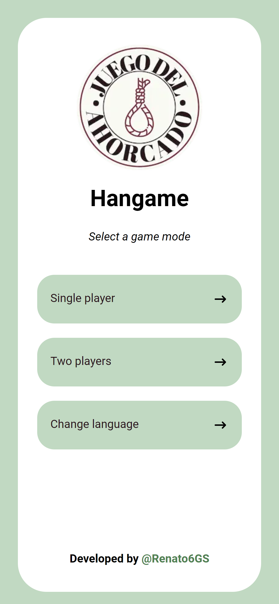
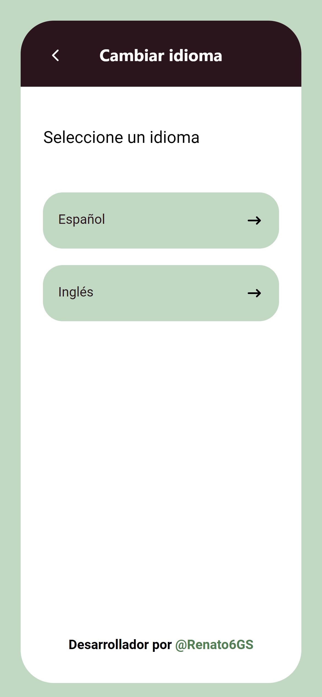
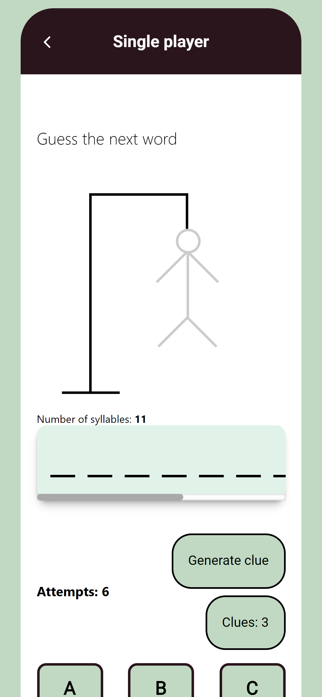
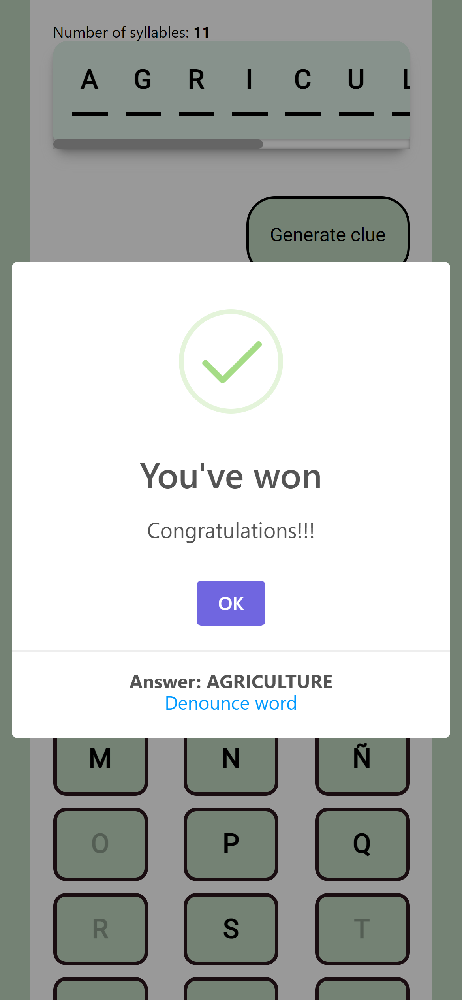

HI! 🥰

This is my first project with React/NextJS made thanks by Midudev's tutorials 😁

[UPDATE 25/01/2023 - Hackathon "Cohere" by Midudev]: This new version will generate words by IA with "Cohere" and will have huge changes. Flask API in heroku will removed and the project will use the API routes from next.js. The current version (developed 10 months ago) is deprecated, mongoDB was deleted from MongoDB Cloud and the flask API was uploaded on Heroku free plan.

[UPDATE 07/01/2023 - Release day for Hackathon]: The current version use Cohere, which generates the words according to a series of parameters and MongoDB (in Railway) to give feedback on the words autogenerated by the AI

## Table of contents

- [Table of contents](#table-of-contents)
- [Overview](#overview)
  - [The challenge](#the-challenge)
  - [Screenshot](#screenshot)
- [My process](#my-process)
  - [Built with](#built-with)
  - [What I learned](#what-i-learned)
  - [Useful resources](#useful-resources)
- [Author](#author)

## Overview

Making this project was really fun and totally easy to do thanks to Midudev's tutorials 💙. It's the first game I've made in my short history as a programmer and I'm quite happy with the end result. Also, this was my first project where I practiced the "Mobile First" 📱 design strategy and it was really helpful.

### The challenge

Users should be able to:

- Play in single player with a difficult and topic selector.
- Create custom words, and send it towards to ther friends.

### Screenshot

- Main menu
  
- Idiom
  
- Gameplay
  
- Idiom
  
- A victory
  

## My process

### Built with

- React
- Next JS
- Vercel
- MongoDB (Railway)
- CSS Style components

### What I learned

I've learned how to use React with Next JS.
I have learned too how to add I18N in an extremely simple way thanks to the latest Midudev tutorial. 😍
I am also proud of the way I handle "responsive design" making a First Mobile design (with Adobe Xd), I didn't know that was helpful but yeah, it is!! 😂

### Useful resources

- [Aprende React](https://www.youtube.com/watch?v=T_j60n1zgu0&list=PLV8x_i1fqBw0B008sQn79YxCjkHJU84pC) - These tutorials taught me how to use React from scratch and I highly recommend them.
- [Aprende NextJS](https://www.youtube.com/watch?v=pFT8wD2uRSE) - With this tutorial I have learned how to develop in Next.js (version 12).

## Author

- [Renato Granados](https://www.renatogranados.dev)
