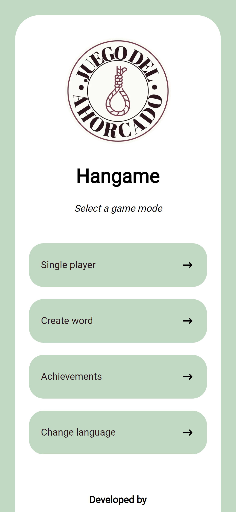

HI! 🥰

This is my first project with React/NextJS made thanks by Midudev's tutorials 😁

## Table of contents

- [Overview](#overview)
  - [The challenge](#the-challenge)
  - [Screenshot](#screenshot)
- [My process](#my-process)
  - [Built with](#built-with)
  - [What I learned](#what-i-learned)
  - [Useful resources](#useful-resources)
- [Author](#author)

## Overview

Making this project was really fun and totally easy to do thanks to Midudev's tutorials 💙. It's the first game I've made in my short history as a programmer and I'm quite happy with the end result. Also, this was my first project where I practiced the "Mobile First" 📱 design strategy and it was really helpful.

### The challenge

Users should be able to:

- Play in single player with a difficult selector.
- Play in multiplayer with another person.

### Screenshot

- Main menu
  
- Idiom
  
- Singleplayer menu
  
- Idiom
  
- A victory
  
- Multiplayer online
  

## My process

### Built with

- React
- Next JS
- Vercel
- API Flask with Python (deployed on Heroku)
- MongoDB (thanks to MongoDB Atlas)
- CSS Style components

### What I learned

I've learned how to use React with Next JS. Link my Front-end with a Back-end thanks to API Flask and MongoDB Atlas.
I have learned too how to add I18N in an extremely simple way thanks to the latest Midudev tutorial. 😍
I am also proud of the way I handle "responsive design" making a First Mobile design (with Adobe XD), I didn't know that was helpful but yeah, it is!! 😂

### Useful resources

- [Aprende React](https://www.youtube.com/watch?v=T_j60n1zgu0&list=PLV8x_i1fqBw0B008sQn79YxCjkHJU84pC) - These tutorials taught me how to use React from scratch and I highly recommend them.
- [Aprende NextJS](https://www.youtube.com/c/midudev) - Currently (13/04/2022), they are not available on youtube, but only on [Midudev's twitch channel](https://www.twitch.tv/midudev), which as you may already know, will be deleted after 2 months. So it will be to be patient.
- [Getting Started With Flask-RESTful API And Deploying to Heroku](https://medium.com/analytics-vidhya/flask-restful-api-with-heroku-da1ecf3e04b) - This helped me how to deploy my Back-end on Heroku with https.

## Author

- [Renato Granados](https://www.linkedin.com/in/renato-granados-636935233/)
